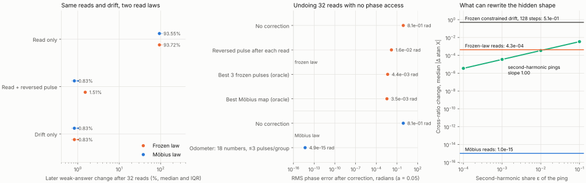

# Möbius pings: reads that compose, a shape they cannot touch

This addendum asks what changes if a MovingTarget2 read is the exact flow that the frozen read law approximates. Predictions and gates were committed before any outcome: [MOBIUS_PROTOCOL.md](MOBIUS_PROTOCOL.md). The frozen experiment, receipt and gates are untouched. Twenty frozen seeds, all reported; **all six gates pass**.



## The picture

A read nudges every oscillator in a group toward the pulse phase φ. The frozen law adds a complex vector and renormalizes, θ → arg(e^{iθ} + a e^{iφ}). To first order in a this is the flow

dθ/dt = sin(φ − θ).

Run exactly for any time τ, that flow is a **Möbius transformation of the circle**. These maps form a group with three real parameters, the symmetries of the hyperbolic disk ([Watanabe & Strogatz 1993, 1994; Marvel, Mirollo & Strogatz 2009](PAPERS.md#möbius-addendum)). For a population of identical oscillators that has three consequences:

1. **Any number of reads is one group element: three numbers per group.** An observer that only remembers which pings it sent can undo all of them, without looking at a single phase.
2. **Each group's N − 3 cross-ratios cannot change.** They are the shape of the group's constellation; here 13 numbers per group, 78 in all. No such ping can write them.
3. **The shape still decides the answers.** The two states in [MATH.md §5](MATH.md#5-equivalence-depends-on-the-strength-of-interrogation) have equal first moments but different shapes, so the same ping moves them differently.

One population therefore carries two kinds of state: a three-number working state that every read moves, and a shape that reads can use but never write. MovingTarget2's constrained drift does the opposite. It keeps the twelve weak-answer numbers and rewrites the shape.

## The frozen law is half a Möbius map

For |z| = 1 and c = a e^{iφ}, the Möbius map (z + c)/(1 + c̄z) sends θ to 2·arg(z + c) − θ. The frozen pulse sends θ to arg(z + c), which is **exactly halfway**. A halfway point agrees with a group element only to first order. So frozen reads do not compose into one element, their reversed pulse is not an exact inverse, and they slowly erode the shape. The identity is checked to 10⁻¹³ in [tests/test_mobius.py](tests/test_mobius.py).

The Möbius read used here, with τ = a so that both laws agree to first order:

θ′ = φ + 2 atan( tan((θ − φ)/2) · e^(−a) ).

## Gates

| Gate | Criterion | Observed | Outcome |
|---|---|---|---|
| G1: law swap in the frozen sequential protocol | Möbius compensated state equals drift-only state, max RMS gap < 10⁻⁹; frozen branch reproduces the frozen receipt < 10⁻⁹ | 1.8×10⁻¹⁴ rad; 5.9×10⁻¹⁵ | Pass |
| G2: three-number odometer | Max RMS phase error after correction < 10⁻⁹, ≤ 3 pulses per group, 18 numbers, no phase access | 6.9×10⁻¹⁵ rad, 2 pulses per group | Pass |
| G3: no small exact fix for the frozen law | Median error > 10⁻⁶ after per-read reversal, best Möbius map, best three frozen pulses | 1.6×10⁻², 3.5×10⁻³, 4.4×10⁻³ rad | Pass |
| G4: pings cannot write the shape, drift can | Möbius max < 10⁻⁹; frozen median > 10⁻⁶; drift median > 10⁻² | 4.9×10⁻¹⁴; 4.3×10⁻⁴; 0.51 | Pass |
| G5: a second harmonic writes in proportion | ε = 0 below 10⁻⁹; log–log slope in [0.9, 1.1] | 9.2×10⁻¹⁴; 0.998 | Pass |
| G6: order and loops rotate | Relative error < 2%; non-uniform spread < 5% of the rotation | 1.54% and 1.59%; 1.73% and 1.74% | Pass |

All gated values are at a = 0.05. Medians across twenty seeds unless a maximum is stated. Shape change is |Δ atan X| per cross-ratio X; it is bounded and does not depend on scale.

## M1. The frozen sequential protocol, only the law swapped

Thirty-two reads cycling the four frozen queries, four constrained drift steps after each, the frozen drift velocities. Measured by the frozen software listener: later weak-answer change.

| Protocol | Frozen law | Möbius law |
|---|---:|---:|
| Drift only | 0.83% | 0.83% |
| Read, then the same pulse reversed | **1.51%** | **0.83%** |
| Read only | 93.72% | 93.55% |

Under the Möbius law the reversed pulse is an exact inverse, so the compensated population **is** the drift-only population, to 1.8×10⁻¹⁴ rad in every seed and after every read. The frozen result's 1.51% − 0.83% gap is therefore entirely the frozen law's second-order remainder. The frozen branch reproduced the original receipt's three sequential numbers to 5.9×10⁻¹⁵.

## M2. Undoing a burst of 32 reads

Same four queries, no drift between reads. RMS phase error against the initial state, median [IQR]; weak and strong answer changes from the frozen listener.

**a = 0.05**

| Correction | Phase error, rad | Weak answers | Strong answers |
|---|---:|---:|---:|
| Frozen law, none | 0.813 [0.772, 0.848] | 94.8% | 99.0% |
| Frozen law, reversed pulse after each read (64 pulses) | 1.56×10⁻² | 1.22% | 1.72% |
| Frozen law, best three frozen pulses per group (oracle) | 4.44×10⁻³ | 0.028% | 0.12% |
| Frozen law, best Möbius map per group (oracle) | 3.50×10⁻³ | 0.016% | 0.22% |
| Möbius law, none | 0.813 [0.773, 0.847] | 94.6% | 98.8% |
| **Möbius law, odometer: 18 numbers, 2 pulses per group** | **4.9×10⁻¹⁵** (max 6.9×10⁻¹⁵) | 4.5×10⁻¹³% | 4.9×10⁻¹³% |

**a = 0.25** (secondary)

| Correction | Phase error, rad | Weak answers | Strong answers |
|---|---:|---:|---:|
| Frozen law, none | 1.72 | 180% | 189% |
| Frozen law, reversed pulse after each read | 0.358 | 31.8% | 39.2% |
| Frozen law, best three frozen pulses per group (oracle) | 0.157 | 5.5% | 9.9% |
| Frozen law, best Möbius map per group (oracle) | 2.58×10⁻² | 0.12% | 1.6% |
| **Möbius law, odometer** | **3.6×10⁻¹³** (max 4.2×10⁻¹³) | 3.7×10⁻¹¹% | 4.0×10⁻¹¹% |

The odometer knows only the query sequence and the amplitude. It multiplies one 2×2 matrix per group and keeps three numbers from it. Afterwards it writes the inverse as pulses: **two pulses sufficed in all 120 groups** at both amplitudes. The longest correction pulse lasted 0.79 at a = 0.05 and 4.0 at a = 0.25.

The oracle rows use the hidden initial phases. They are the best fits a multi-start local search found within each correction family, not proven global optima; for the three-pulse family at a = 0.25, one seed had a 0.6% lower value in an earlier run (see the correction log). They show what such corrections could at most achieve, not what an observer could do.

**No Möbius map can repair shape damage.** Applying any group element leaves every cross-ratio unchanged. The oracle Möbius map row therefore keeps exactly the frozen reads' shape damage: 4.3×10⁻⁴ at a = 0.05 and 3.65×10⁻³ at a = 0.25. Erosion by the frozen law is permanent for every correction inside the group.

## M3. What rewrites the shape

| Process | Median shape change | Maximum |
|---|---:|---:|
| 32 Möbius reads, a = 0.05 | 1.0×10⁻¹⁵ | 4.9×10⁻¹⁴ |
| 32 Möbius reads, a = 0.25 | 4.5×10⁻¹⁴ | 1.4×10⁻¹¹ |
| 32 frozen reads, a = 0.05 | 4.3×10⁻⁴ | 1.3×10⁻² |
| 32 frozen reads, a = 0.25 | 3.65×10⁻³ | 0.22 |
| Frozen constrained drift, 128 steps, no reads | **0.51** [0.42, 0.58] | 3.1 |

Pings and the frozen drift move complementary things. Möbius pings move the three group numbers and leave the shape alone. The drift keeps the twelve weak-answer numbers and rewrites the shape.

## M4. Only a non-Möbius push writes the shape

Each ping becomes dθ/dt = sin(φ − θ) + ε sin(2(φ − θ)), integrated for time 0.05 with 64 Runge–Kutta substeps; 32 reads.

| ε | Median shape change | Odometer phase error afterwards, rad |
|---:|---:|---:|
| 0 | 1.9×10⁻¹⁵ | 3.2×10⁻¹⁵ |
| 10⁻⁴ | 3.50×10⁻⁶ | 7.7×10⁻⁵ |
| 10⁻³ | 3.50×10⁻⁵ | 7.7×10⁻⁴ |
| 10⁻² | 3.49×10⁻⁴ | 7.7×10⁻³ |
| 10⁻¹ | 3.46×10⁻³ | 7.6×10⁻² |

Shape change is proportional to ε, with log–log slope 0.998. The second harmonic is what writes; the first harmonic only reads. The odometer's residual grows by the same factor, because its correction stays inside the group.

## M5. The order of two pings, and a closed loop

For every seed and group, pings at φ₁ (the group's mean phase) and φ₂ = φ₁ + Δ, Δ ∈ {π/6, π/2, 5π/6}, a = 0.05; 360 cases.

- **Swapping the order** leaves a common rotation of a² sin(φ₂ − φ₁). The commutator of the two flows is sin(φ₂ − φ₁) d/dθ, the same at every phase. Median relative error 1.54%; the part that differs between oscillators is 1.73% of the rotation.
- **A closed loop**, +a at φ₁, +a at φ₂, −a at φ₁, −a at φ₂, returns every pulse to zero but leaves the same rotation: the loop's enclosed area in the hyperbolic disk. Median relative error 1.59%; non-uniform part 1.74%.

The errors are third-order terms, of relative size about a. They are larger than for uniformly spread phases because these groups are clustered.

A common rotation changes no phase difference inside a group. A reader comparing a group's own units cannot see which order the pings came in. The query port can, because its pulse phases are fixed in an outside frame. The order of events is stored where only an outside clock reads it.

## Descriptive: the odometer with drift between reads

Run on the frozen sequential protocol under the Möbius law, a single correction after all 32 reads left a **17.4%** weak-answer change [14.1%, 22.4%], against 0.83% for drift only. The odometer does not see the drift, and drift does not commute with reads. With uncontrolled drift between reads, a reversed pulse after every read remains the method; it is exact under the Möbius law.

## What this adds, and what it does not

**Established before this work:** identical oscillators under common first-harmonic forcing evolve by Möbius maps, with N − 3 cross-ratio constants of motion (Watanabe & Strogatz 1993, 1994; Pikovsky & Rosenblum 2008; Ott & Antonsen 2008; Marvel, Mirollo & Strogatz 2009). The bracket identity and the rotation left by a loop are standard Lie-group facts.

**Measured here, inside MovingTarget2's frozen protocol:**

- the frozen read law is the angular midpoint of a Möbius map, which explains its compensation residual exactly;
- an observer holding 18 numbers, with no phase access, undoes any burst of reads with two pulses per group;
- the cross-ratios behave as a memory that first-harmonic reads cannot write and the frozen drift rewrites;
- second-harmonic content writes that memory in proportion to its size;
- the order of reads is stored as a common rotation that only the outside-anchored query port can read.

I have not searched for these specific memory readings in the literature beyond the papers above.

**Not shown:** biological plausibility; non-identical frequencies, noise or finite relaxation, all of which break the group; a working odometer when uncontrolled drift is interleaved with reads; realizing the correction through the shared query port rather than per-group pulses.

## Costs and access

| Item | Requirement |
|---|---|
| Odometer state | 18 real numbers, three per group |
| Odometer inputs | the applied query sequence and amplitude; no oscillator phases |
| Correction port | one pulse phase and duration per group; stronger than the frozen query port |
| Correction pulses | 2 per group in every case, versus 32 extra query pulses for per-read reversal |
| Oracle rows | use the hidden initial phases; bounds, not observers |
| Listener | unchanged frozen software listener |

## Correction log

**2026-10-08, after the first full run.** The first run's oracle fits at a = 0.25 stalled in many groups. Strong frozen reads compress some groups into an arc so narrow that the correcting map is a hyperbolic expansion of length 6–8, and its basin is very thin. A cross-ratio evaluation also lost precision for nearly coincident points. Fixes: a hyperbolic-distance parametrization, a coarse hyperbolic grid, a first start that fits the well-conditioned forward map and inverts it, sine-form cross-ratios, and a guard for non-finite trial steps. A second run with only the first two fixes still missed the basin in some groups; the third run is canonical.

Thresholds, seeds, amplitudes, queries and the gate list did not change. All six gates passed in all three runs, and every a = 0.05 value agrees across them to within 10⁻⁹. The a = 0.25 oracle Möbius-map median moved from 0.309 rad to 0.0258 rad, and the three-pulse median from 0.267 to 0.157. No seed got worse than in either earlier run, except one seed of the three-pulse row, which was 0.6% higher than in the second run. Earlier receipts are kept: [first](results/mobius_receipt-first-run.json.gz) (uncompressed SHA256 `521c8c1f44e55951d51161974dbc7cd60de34d8cf4957af6e6d31aef12836615`) and [second](results/mobius_receipt-second-run.json.gz) (`cf5c65fe10f992d0fc8fc41bd228583426c0d6be62edb4b472f86a11ec0c614a`).

A one-seed smoke run on seed 4100 was made during development, before the full runs.

## Reproduce

```bash
python -m unittest discover -s tests -v
python mobius_experiment.py                                   # about 13 minutes on one CPU core
python mobius_experiment.py --verify results/mobius_receipt.json
python mobius_experiment.py --smoke --output /tmp/mobius-smoke.json
```

The canonical receipt was produced with Python 3.13 and NumPy 2.5.3 and also verified under NumPy 2.3.5, the version CI installs.
