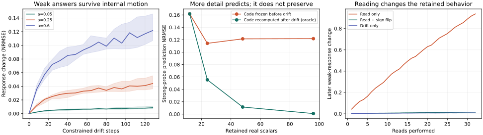

# MovingTarget2 — memory defined by its responses

> Can a remembered object keep producing the right responses to new pings while its underlying neural coordinates change—and can that behavior be described with little retained state?

**In this controlled oscillator model, yes for weak queries, with a measurable boundary.** Ninety-six individual phase coordinates reorganized by a median 0.63 radians RMS. A twelve-number code, fitted once from noisy calibration pings, still predicted responses to unseen weak pings with **1.83% normalized error** across twenty fixed seeds.

The simulator deliberately preserves six group-average phase signals. The result tests what that preservation makes possible. It does not demonstrate that a neural circuit naturally enforces this constraint.

## The measured result

Twenty seeds, 64 calibration pings and 512 independent held-out query points per seed; all seeds are retained. “Error” below is RMSE divided by the RMS initial response, not classification error or percentage accuracy.

| Measurement | Median |
|---|---:|
| Individual phase change after 128 constrained drift steps | 0.630 radians RMS |
| Change in actual answers to weak pings, a=0.05 | **0.86%** |
| Frozen fitted 12-number code: prediction error after drift | **1.83%** |
| Same calibration data stored as a nearest-query table | 49.71% |
| Change in answers to strong pings, a=0.6 | **12.18%** |
| Weak-answer change after shuffling units between query groups | **95.31%** |

The code is a known Fourier/moment model with twelve coefficients, so its advantage over a nearest-query table is a consequence of using the right response family. This is not a comparison with general learned compression.



## What the “object” is here

Each group receives a query with a different phase. Its individual oscillators can move while its average complex phase remains fixed. Weak answers depend mainly on these six averages: twelve real numbers. Many different internal states therefore produce almost the same family of answers.

**The persistent object is the response family at a specified query strength and tolerance.** Stronger pings reveal higher phase moments, which the small code discards. Reassigning groups to different query ports changes meaning even when the overall multiset of phases stays the same.

There is a further distinction: the twelve numbers predict today's weak answer, but they do not completely determine what a read does to tomorrow's memory. The first-order update of a first moment depends on the second moment. Two states with the same weak-answer code can evolve differently under the same read. [The derivation and a concrete counterexample are in MATH.md.](MATH.md#6-a-sufficient-answer-code-need-not-be-a-sufficient-dynamical-state)

## Repeated reads

Thirty-two actual weak reads, cycling four fixed queries, changed later weak responses by **93.72%**. Following every read with the same sign-reversed pulse reduced that change to **1.51%**; constrained drift without reads gave **0.83%**. Compensation cancels the leading disturbance, while a smaller residual remains.

This uses unit-radius oscillators and instantaneous radial normalization between pulses. It is an idealized extension of [VMN's query-and-restore work](https://github.com/anttiluode/VMN), not a new measured physical interface.

## What the small code costs

The twelve-number code is 96 bytes in float64, versus 768 bytes for the 96 physical angles: **eightfold per-object payload reduction** for weak-response emulation. The shared query-mode table adds 96 bytes. The estimator uses 64 noisy reset pings and a 6,144-byte design matrix. Fixed group identity and a known response law are part of the model.

The experiment still holds the physical population. Its software listener reads individual phase advances; its drift controller allocates full-population arrays. Calibration uses copies of the initial state, and held-out targets are noiseless analytic responses. These costs and assumptions are [listed in RESULTS.md](RESULTS.md#costs-and-access). A compact description does not by itself make the physical system cheap to observe or maintain.

## Read or run

- [RESULTS.md](RESULTS.md): all gates, uncertainty across seeds, costs and limits.
- [MATH.md](MATH.md): exact finite-pulse law, moment expansion and failure of dynamical closure.
- [PROTOCOL.md](PROTOCOL.md): thresholds and access rules committed before outcomes.
- [PAPERS.md](PAPERS.md): primary literature and project genealogy.
- [REVIEW.md](REVIEW.md): independent review, accounting correction and one deferred verifier limitation.
- [Full receipt](results/receipt.json): every seed, calibration fit, trajectories and initial/final phases.

```bash
python -m pip install -r requirements.txt
python -m unittest discover -s tests -v
python experiment.py                         # full twenty-seed run
python experiment.py --verify results/receipt.json
python experiment.py --smoke --output /tmp/movingtarget2-smoke.json
```

The recorded full run used Python 3.12.14 and NumPy 2.3.5 on CPU. Verification permits small floating-point differences. A smoke run makes no full-gate claims; `--verify` checks all reported fields and values, although it is not a strict JSON type validator.

## Relation to the older Moving project

The earlier repository is [MovingProblem](https://github.com/anttiluode/MovingProblem). It already separated invariant computation from semantic orientation, and showed a coordinate tracker returning with a wrong sign after a closed loop. It remains frozen at Gate 4.

MovingTarget2 asks what responses actually need to survive, and how strong a new query must be before hidden changes become visible. The next mechanism question is how a population could maintain the relevant response coordinates under uncontrolled drift, with an affordable observer. This repository establishes the controlled target and its boundaries.
