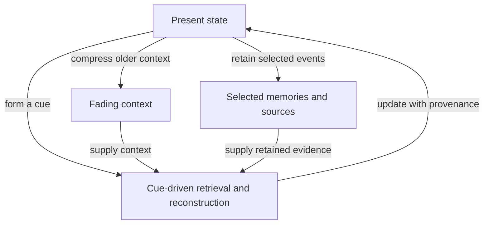

# Brains, languages and memory worlds

[Back to MovingTarget2](../README.md) · [Geometry: AnttisBrain2](https://github.com/anttiluode/AnttisBrain2) · [Sources and ancestry](../PAPERS.md) · [Measured results](../RESULTS.md)

> Can a partial cue recover the right object when the machinery representing it has changed?

Antti's picture developed while exploring [AnttisBrain2](https://github.com/anttiluode/AnttisBrain2): a room containing moving moons and reflections. Imagining a ride with a moon changes the frame from which the room is seen. Letting reflection depth represent age suggests a present containing compressed influences of earlier moments. Keeping selected traces somewhere addressable adds the possibility of recall.

The useful connection is between **a changing representation, a cue that still finds its target, and a response checked against retained evidence**. The geometry makes those roles visible. Establishing a mechanism requires defining and testing them separately.

## The geometric origin: AnttisBrain2

[AnttisBrain2](https://github.com/anttiluode/AnttisBrain2) supplies the visual setting: procedural chambers, moving optical moons, recursive reflections and an incoming webcam image. The memory architecture below grew out of looking at that renderer and asking what it would mean to stay steady relative to a moving moon, or to reopen a faded reflection.

The proposed interpretation assigns a moon a local frame, a reflection a compressed view, and recorded depth an age. Those are roles for a future memory model. The renderer's bounce depth is a spatial/optical recursion count; temporal memory additionally requires retained earlier states. The link records the origin of the idea, rather than treating the graphics engine as a neuroscience experiment.

## What has evidence, and what is proposed?

| Status | What we have | What it supports |
|---|---|---|
| Measured here | A controlled oscillator population changes while a small code continues predicting weak responses. Stronger reads expose hidden differences. | A bounded example of response preservation under imposed drift. |
| Observed in other research | Cue-driven event reinstatement in humans; partly shared multilingual features in particular LLMs; limited cross-language propagation of some knowledge edits. | Real settings in which access, representation and output can be studied separately. |
| Proposed here | Compressed context plus selected memories, version-aware retrieval, provenance and independently checked transport maps. | A candidate architecture and experiments. No brain/LLM experiment below has been run in this repository. |

## A. The brain connection: a cue can reopen an event

In [Horner et al. (2015)](https://www.nature.com/articles/ncomms8462), participants learned associations among event elements. At recall, activity associated with an additional, unrequested element was reinstated, and this reinstatement was related to hippocampal activity. The results support pattern completion: a partial cue can help reactivate a larger associated event.

In the moon picture, the cue is a doorway and the reopened room is the associated event. Reconstruction may draw on information retained across multiple regions; details absent from one active summary need not have been destroyed everywhere.

This experiment does not establish recursively nested visual memories. It gives a specific empirical connection: partial input can recover more of an event than the cue itself contains.

Remembering also occurs in the present. [Davidson et al. (2009)](https://pmc.ncbi.nlm.nih.gov/articles/PMC4364032/) measured forward and reverse replay of spatial sequences in rats. The order traversed by an internal representation can differ from the direction in which physical time advances.

## B. The LLM connection: different language cues can reach shared machinery

[Anthropic's 2025 study](https://transformer-circuits.pub/2025/attribution-graphs/biology.html) found both shared multilingual features and language-specific components in Claude 3.5 Haiku. In English, French and Chinese examples, related circuits performed the semantic operation while other components controlled the output language. Translated-paragraph comparisons found more sharing in intermediate layers and more sharing than in a smaller model.

[Wendler et al. (2024)](https://aclanthology.org/2024.acl-long.820/) studied selected Llama-2 next-token tasks. Intermediate states favored English versions of appropriate continuations before moving toward the requested language. Their proposed input/concept/output picture includes an English bias.

Languages can therefore serve as different **perspectives on a task**. Shared features are candidates for reusable semantic machinery. Calling them the place where one invariant tensor lives would go beyond these results.

There are two separate moving-target questions:

| Change | What changes | What to test |
|---|---|---|
| Language or context changes in a frozen model | Tokens, activations and computation paths; the learned weights stay fixed. | Can different cues access the same fact or operation? |
| Learning or fine-tuning changes the model | The encoder, reader and the meaning of some stored activations may change. | Can old latent memories still be read accurately? |

A language change is not automatically an invertible coordinate change. Translation can alter meaning; tokenization and available knowledge differ. Likewise, good cross-language answers do not prove a unique shared representation.

[Cross-language editing research](https://aclanthology.org/2024.findings-eacl.140/) has measured limited propagation of edits between languages in several models. That provides a useful failure to investigate. A failed answer alone cannot locate the failure: encoding, access, output behavior or the update itself could contribute.

## C. Mapping AnttisBrain2's geometry to an AI architecture

This is a design vocabulary. A *language moon* describes a perspective; a *memory moon* below is a selected stored item with a retrieval interface. They have different computational roles.

| Geometry | Candidate implementation | What must be retained or checked |
|---|---|---|
| Present room | A recent window of token or frame activations, an N-by-d tensor. | Current observations and their source/time. |
| Fading reflections | A bounded collection of compressed older activation blocks. | Age, compression level and the errors relevant to later queries. |
| Glow | A small, slowly updated summary of context. | Its update rule and which distinctions it discards. A fixed vector with finite precision cannot preserve every past fact. |
| Memory moons | Selected event records with latent values, retrieval keys and frame metadata. | Model version, layer, source pointer, event time and uncertainty. |
| Entering a reflection | Retrieve evidence, decode a stored trace, and optionally generate a completion. | Which claims are source-supported and which are inferred. |
| Next room and frame checks | Predict upcoming observations; test independently fitted transports on held-out memories and paths. | Prediction error, retrieval accuracy and transport mismatch, scored separately. |

The proposed data flow is:

The repeated arrows are processing steps. Actual event time must be recorded separately. Recursive reflections of the current input acquire temporal meaning only when their layers contain retained earlier states.

### Compression needs a stated bound

[Compressive Transformer](https://arxiv.org/abs/1911.05507) already retains compressed older activations. [FramePack](https://proceedings.neurips.cc/paper_files/paper/2025/hash/2bde8fef08f7ebe42b584266cbcfc909-Abstract-Conference.html) allocates a fixed video context budget according to frame importance. Repeated compression and age-dependent detail are plausible design choices with substantial prior art.

A simple additive fading model illustrates what a guarantee can mean. For encoded events with norm at most B and a weight ratio 0 < rho < 1, the norm of the contribution omitted beyond depth K is at most:

$$
\frac{B\rho^{K+1}}{1-\rho}.
$$

This is a standard geometric-tail bound under the stated additive, bounded-input assumptions. A learned compressor and a nonlinear decoder require their own analysis. A small contribution in one norm does not guarantee that an old password, promise or rare event remains answerable.

Fading also does not establish physical time's arrow. Exact scaling can be inverted. Discarding distinctions, limited precision and noise can prevent reliable recovery.

### Moons need a reader, not just a tensor

In machine learning, "tensor" commonly means a multidimensional array. A coordinate-independent mathematical interpretation additionally needs specified transformation rules. Array shape alone does not establish invariant meaning. [MATH.md](../MATH.md#8-coordinates-tensor-language-and-meaning) gives a clean linear case: transform the state and its reader together, and the answer can stay unchanged.

For a stored memory, the proposal is to record the representation's model version and layer, then learn a task-specific map into the current reader's representation. Learning can also erase distinctions or change nonlinear computation. An invertible global transport may not exist.

[RoPE](https://arxiv.org/abs/2104.09864) supplies known positional rotations of attention queries and keys. It is an example of explicit coordinate bookkeeping, not evidence that model-update drift is rotational or already repaired.

### Retrieval needs evidence accounting

Keep separate records for information fetched from a source, information decoded from a latent memory, and generated completion. A source pointer lets a claim be checked; it does not guarantee that the source is correct or current. Attaching an uncertainty label does not itself calibrate that uncertainty.

The design goal is to preserve these distinctions through reconstruction and measure unsupported additions. Generated detail should not silently become a new source observation on the next pass.

### Loop checks need independent paths

Fit maps between representations on calibration items, then compare direct and multi-step transports on held-out items. For example, compare Finnish-to-German directly with Finnish-to-English-to-German, and test a return path.

An independently measured mismatch can expose a problem. It can arise from fit error, semantic differences or information loss; it is not automatically mathematical holonomy or hallucination. A map followed by its imposed inverse can close by construction. A zero residual can also preserve the wrong fact.

## D. Two experiments that separate the questions

### 1. Cross-language access in a frozen model

Use a fixed open multilingual model, validated translations and several paraphrases of each query. Keep a separate table of expected answers. Include deliberately ambiguous examples rather than assuming every translation is exact.

Measure correctness in each language, agreement across languages and sensitivity to paraphrasing separately. Agreement on the same wrong answer is a failure of grounding.

An optional activation study can fit simple language-to-language maps on calibration concepts, then test held-out concepts and independently fitted paths. Causal interventions and decoded behavior would provide stronger evidence than vector similarity alone.

### 2. Stored memories across a model update

Store latent memories and original sources before a controlled fine-tune. Use disjoint update data, including new synthetic facts taught in Finnish, and assess access in Finnish, English, Swedish and German. Keep a recorded answer table.

Score new-fact transfer separately from recovery of unchanged pre-update memories. The new facts were not present in the old stored vectors. Declare the extraction layer, token positions and memory-reading interface before comparing methods.

Compare old raw vectors, old vectors passed through a learned transport, and fresh encodings of the retained source. Include a simple linear or affine alignment baseline. Fresh source encoding is a reference baseline, not a guaranteed upper bound.

Fit transports on a disjoint set of anchor memories. Evaluate the same held-out items under every method. Use matched update budgets for monolingual and bilingual training; adding a second language does not by itself force knowledge into middle layers.

Report correct recall, unsupported details, unchanged-fact damage, latency and total storage. Count source storage, alignment parameters, anchor data and calibration/training costs. Test whether enough information survives to answer a later interaction, not just the first query.

**Candidate success:** transport improves held-out old-memory recall over raw vectors and simple alignment, while retaining useful savings relative to source re-encoding after all costs are counted.

**Informative failure:** raw vectors remain adequate, a simple map performs equally well, or lost information cannot be restored through transport. Each result narrows the mechanism.

## What this adds to MovingTarget2

The oscillator experiment separates a code sufficient for today's weak answers from a state sufficient for later interactions. The proposed architecture extends that distinction to retrieval:

**What must survive for a future cue to find the right event, and what evidence constrains the reconstructed answer?**

The brain work supplies an observed cue-to-event connection. Multilingual models supply an observed setting for partly shared computation and uneven access. The moons supply a geometric way to inspect the candidate mechanism. Their combination is a research direction; novelty and usefulness remain to be demonstrated.
